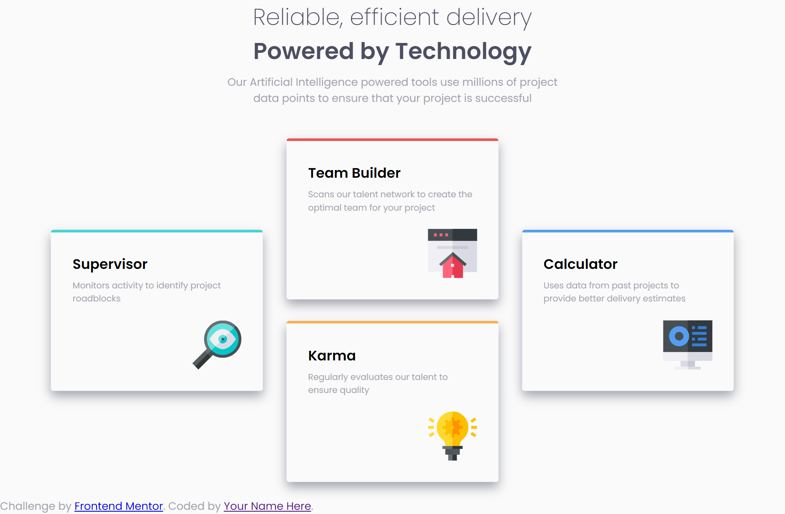
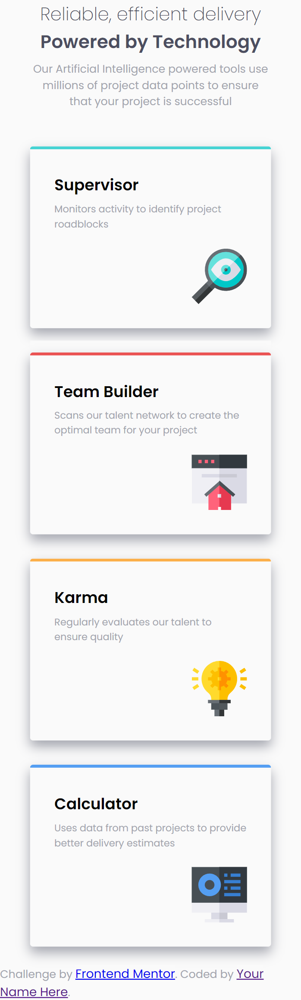

# Frontend Mentor - Four card feature section solution

This is a solution to the [Four card feature section challenge on Frontend Mentor](https://www.frontendmentor.io/challenges/four-card-feature-section-weK1eFYK). Frontend Mentor challenges help you improve your coding skills by building realistic projects. 

## Table of contents

- [Overview](#overview)
  - [The challenge](#the-challenge)
  - [Screenshot](#screenshot)
  - [Links](#links)
- [My process](#my-process)
  - [Built with](#built-with)
  - [What I learned](#what-i-learned)
  - [Continued development](#continued-development)
  - [Useful resources](#useful-resources)
- [Author](#author)
- [Acknowledgments](#acknowledgments)

**Note: Delete this note and update the table of contents based on what sections you keep.**

## Overview

### The challenge

### Screenshot

### Links

- [Soloution URL:](https://github.com/Callietron300/Four-Card-Feature-Section)
- [Live Site URL:](https://callietron300.github.io/Four-Card-Feature-Section/)

## My process

### Built with

- Semantic HTML5 markup
- CSS custom properties
- Flexbox
- CSS Grid

# Time taken to build project 

2 Hours

# What went well

Really happy with how project went- felt like I was able to quickly build the HTML and the styling

# What I struggled with 

Still getting there with flex box- had to look at other codes for soution for the middle part but worked out the flex myself. 
Wanted use nth-child for the border tops for less code in the HTML but due to the flex soltuion i used I couldnt
Still need to understand best practices for margins for even spacing as I am making it up but feel there is some guidelines i could be following

